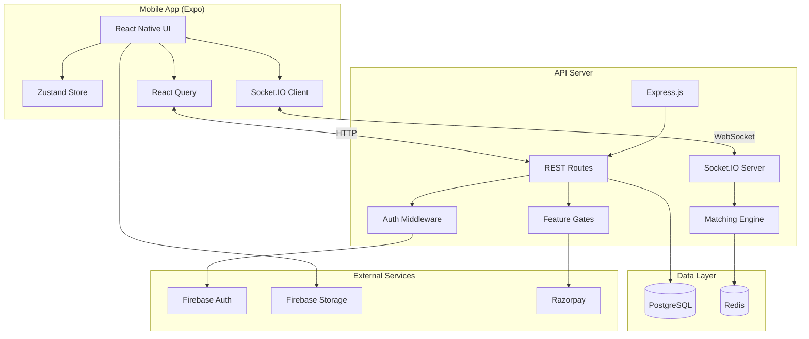

# LeadChat

> Real-time B2B lead discovery platform for the Indian market.
> Match. Chat. Close. — Find your next client in 30 seconds.

## Architecture



## Tech Stack

| Layer | Technology |
|-------|-----------|
| Frontend | React Native (Expo) — iOS + Android + Web |
| Backend | Node.js + Express + TypeScript |
| Realtime | Socket.IO |
| Database | PostgreSQL 16 |
| Cache | Redis 7 |
| Auth | Firebase Auth (Phone OTP) |
| Storage | Firebase Storage |
| Payments | Razorpay (UPI + Cards) |

## Prerequisites

- **Node.js** >= 20.0.0
- **npm** >= 10.0.0
- **Docker Desktop** (for PostgreSQL + Redis)
- **Expo CLI** (`npx expo`)

## Quick Start

```bash
# 1. Clone the repository
git clone <repo-url>
cd LeadChat

# 2. Copy environment variables
cp .env.example .env

# 3. Start database services
npm run docker:up

# 4. Install all dependencies
npm install

# 5. Build shared types
npm run build:shared

# 6. Start the API server
npm run dev:api

# 7. Start the mobile app (in a new terminal)
npm run dev:mobile
```

## Project Structure

```
LeadChat/
├── apps/
│   └── mobile/              # React Native Expo app
├── packages/
│   ├── api/                 # Express + Socket.IO backend
│   └── shared/              # Shared types & constants
├── infra/
│   ├── docker/              # Docker Compose (Postgres + Redis)
│   └── db/                  # SQL migration scripts
├── docs/                    # Documentation
└── .github/workflows/       # CI/CD pipeline
```

## Monorepo Workspaces

| Package | Description |
|---------|-------------|
| `@leadchat/mobile` | React Native Expo mobile app |
| `@leadchat/api` | Express REST API + Socket.IO server |
| `@leadchat/shared` | Shared TypeScript types & constants |

## Mission Roadmap

| Phase | Missions | Timeline | Status |
|-------|----------|----------|--------|
| MVP | 1–3 (Scaffolding → Matching → UI) | Weeks 1–4 | 🟡 In Progress |
| Core | 4–5 (AI Scoring → Billing) | Weeks 5–8 | ⬜ Planned |
| Retention | 6 (Deal Rooms & CRM) | Weeks 9–11 | ⬜ Planned |
| Launch | 7 (Testing & App Store) | Week 12 | ⬜ Planned |

## Development Commands

```bash
npm run dev:api          # Start API server with hot reload
npm run dev:mobile       # Start Expo dev server
npm run build:shared     # Compile shared types
npm run build            # Build all packages
npm run test             # Run all tests
npm run lint             # Lint all TypeScript files
npm run docker:up        # Start PostgreSQL + Redis
npm run docker:down      # Stop Docker services
npm run docker:logs      # View Docker service logs
```

## License

Confidential — For Development Use Only
